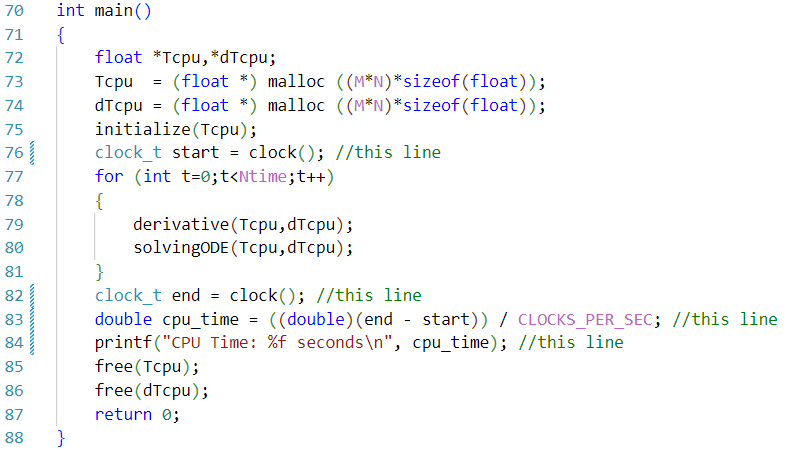
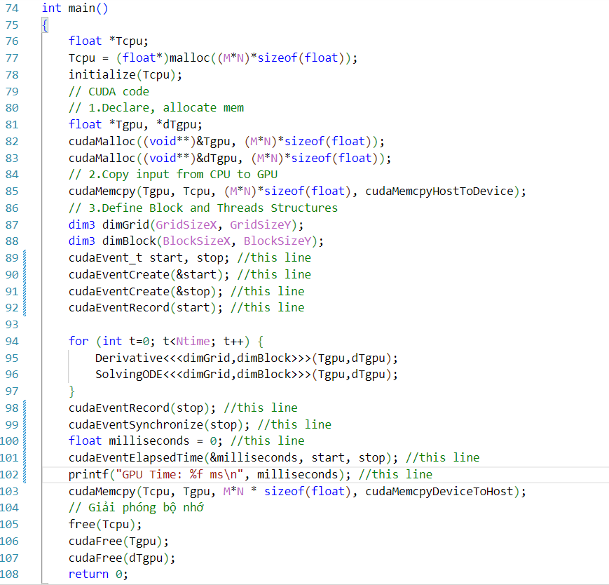
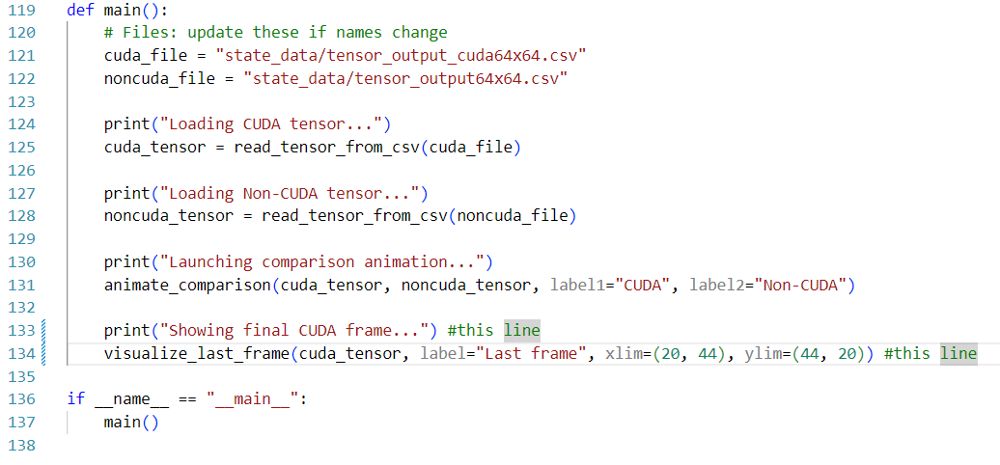

# 2D Heat Equation- Forward Euler method

This README will guide you through how to run the main components of our group program, as well as the visualization video.

## 1. Main files/programs
The main components of this project are the HeatEquation2Dtime.c and HeatEquation2Dtime.cu. 

### C code
To run the C files (locally on your personal computer), you need to have a C/C++ compiler. One of the compiler - **MinGW**, which can be downloaded from this [link](https://sourceforge.net/projects/mingw/).

To run the C code on your local computer, you need to do the following:
- Clone this repository. 
```
git clone https://github.com/uservinhsoislearning/2DHeatEquation
``` 
- (Optional) Comment out these lines if you don't want to record runtime. 

- (Optional) Add in this line (after the for loop on line 77) if you want to print the last state of the metal plate (grid).
```
printGrid(Tcpu);
```
- Compile C code using this command.
```
gcc HeatEquation2Dtime.c -o <your desired file name>
```
- Run the C code using this command
```
./<your desired file name>
```
After the first compilation, you can just run the compiled file (unless there is some changes in the C file).

You can also run the code on a virtual machine (Kaggle or Google Colab). Simply copy all contents of the HeatEquation2Dtime.c file, copy it into 1 code block. Then, create 2 more code blocks for compiling and running the compiled file. The first code block (of the created code blocks) should contain this command
```
!gcc HeatEquation2Dtime.c -o <your desired file name>
```
The second code block (of the created code blocks) should contain this command
```
!./<your desired file name>
```

### CUDA code
To run the CUDA files (locally on your personal computer), you need to have a C/C++ compiler and a GPU supports CUDA. Installing CUDA will not be included in this file, I will only guide you through how to run the CUDA files on Kaggle/Google Colab, as this is how I ran the files and recorded runtimes. 

First you need an account on Kaggle or Google Colab, because there are many tutorials (and the websites provided useful instructions).

Create a new Jupyter notebook, create a code block and include the following line:
```
%%writefile HeatEquation2Dtime.cu
```
This line will write to a file (runtime) called HeatEquation2Dtime.cu 

Now do the following steps:
- On the same code block, paste all the content in the HeatEquation2Dtime.cu in my repository

- (Optional) Comment out these lines if you don't want to record runtime. 

- (Optional) Add in this line (after the cudaMemcpy() on line 103) if you want to print the last state of the metal plate (grid).
```
printGrid(Tcpu);
```
- Compile CUDA code using this command (on a different code block).
```
!nvcc HeatEquation2Dtime.cu -o <your desired file name>
```
- Run the CUDA code using this command (on a different code block).
```
./<your desired file name>
```

## 2. Visualization
This repository also includes a video for visualization, but only for the 64x64 grid. This works by storing all states of the grids (in HeatEquation2D.c and in HeatEquation2D.cu) in a Tensor (NtimexMxN). 

You can run the video yourself in visualization.py file, just run this command to install the required libraries
```
pip install -r requirement.txt
```

This **MUST** be run on personal computer.

The result is the same as in visualize_video.mp4. In the report and in our slide, we have included a photo of a state to compare between the CUDA calculation and the Sequential/Serial calculation.

You can see in the video down here:

https://github.com/user-attachments/assets/fbe5fbd7-64bc-4e89-a080-74c298711341

You can un-comment these line if you want to see the last frame of the metal plate (also included in our report and slide)



